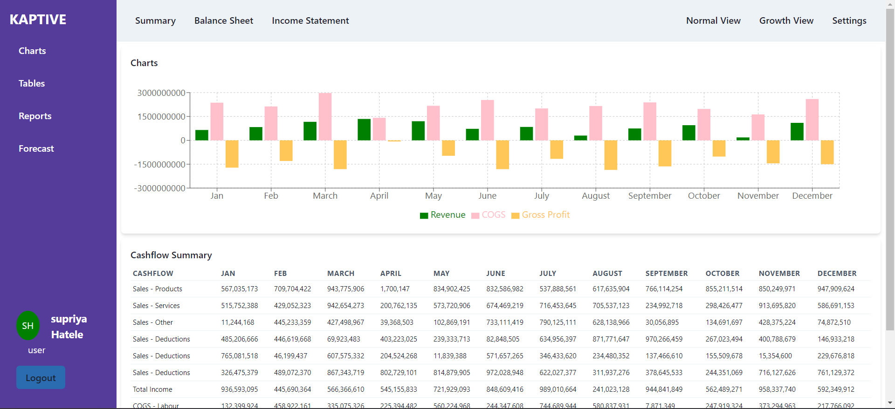

## Deployed Link- https://kaptive-assignment-gpqz.vercel.app/
   ## email:
    spriya20@gmail.com 
   ## password:
    supriya1234
## Technologies Used
- **Backend**:
  - Node.js
  - Express.js
  - MongoDB
- **Frontend**:
  - JavaScript
  - React.js
  - ChakraUI
  - Redux
  
- **Other Tools**:
  - JSON Web Tokens (JWT) for authentication
  - bcrypt.js for password hashing
  - Axios for HTTP requests
## Directory Structure

## Screenshots:

### DashBoard

